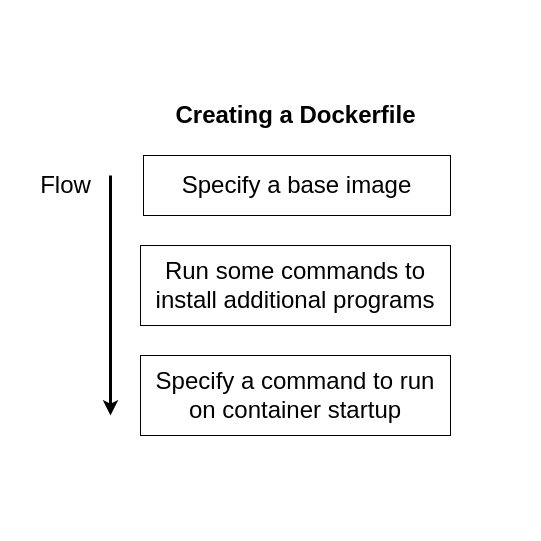

# Learn Docker in a day

## Table of Contents

1. [Why use Docker?](#1-why-use-docker)<br/>
2. [Introduction to Docker](#2-introduction-to-docker)<br/> 
    2.1. [What are docker image and docker container?](#21-what-are-docker-image-and-container)<br/>    
3. [Using the Docker Client](#3-using-the-docker-client)<br/>
    3.1. [Using the docker run command](#31-using-the-docker-run-command)<br/>
    3.2 [docker run in detail](#32-docker-run-in-detail)<br/>
    3.3 [List running containers](#33-list-running-containers)<br/>
    3.4 [What docker run is equals to?](#34-what-docker-run-is-equals-to)<br/>
    3.5 [Creating a container](#35-creating-a-container)<br/>
    3.6 [Starting a container](#36-starting-a-container)<br/>
    3.7 [Restarting a stoppped container](#37-restarting-a-stopped-container)<br/>
    3.8 [Removing a stopped container](#38-removing-a-stopped-container)<br/>
        3.8.1 [Remove using docker system prune command](#381-remove-using-docker-system-prune-command)<br/>
        3.8.2 [Removing container using docker container rm commmand](#382-removing-container-using-docker-container-rm-command)<br/>
    3.9 [Retrieving logs from a container](#39-retrieving-logs-from-a-container)<br/>
    3.10 [Stopping a container](#310-stopping-a-container)<br/>
        3.10.1 [Stopping using docker stop command](#3101-stopping-using-docker-stop-command)<br/>
        3.10.2 [Stopping using docker kill command](#3102-stopping-using-docker-kill-command)<br/>
    3.11 [Executing command in running container](#311-executing-command-in-running-container)<br/>
4. [Creating Docker Image](#4-creating-docker-image)<br/>
    4.1. [Dockerfile in more detail](#41-dockerfile-in-more-detail)<br/>
    4.2. [Building the image](#42-building-the-image)<br/>
    4.3. [Running the created image](#43-running-the-created-image)<br/>

## 1. Why use Docker?

Docker wants to make it really easy and really straightforward for you to install and run software on any given 
computer. 

## 2. Introduction to Docker

Docker is a platform or ecosystem around creating and running containers. The ecosystem includes:

1. Docker Client
2. Docker Server
3. Docker Machine
4. Docker Images
5. Docker Containers
6. Docker Hub

### 2.1. What are Docker Image and Container?

Linux OS has two features that really make docker happen. The two features are:

1. NameSpacing
   - **Definition** - Isolating resources per process (or group of processes)

2. Control Groups(cgroups)
   - **Definition** - Limit amount of resources used per process.

You use these two features to separate the file system and the physical resources into small modules or *containers*.

Hence, an *image* is a single file with all the dependencies and configuration required to run a program. It includes the
*file snapshot* and the *startup command* to execute when starting the container. A container then, is an instance of an
image that runs a program. The container is isolated from the main operating system and has its own resources and filesystem.

**Note:** Containers can only exist on Linux. So, when you install docker on your system, you are actually installing a Linux
VM if you are not using Linux as OS.

## 3. Using the Docker Client

The **docker client** provides us with the `docker` cli command. You can run `docker` on the command line to see the list
of commands.

Command:
```
docker 

or

docker --help
```

**Syntax:** `docker [options] command`

**Example:**
```
suman@ubuntu-local:~$ docker 

Usage:  docker [OPTIONS] COMMAND

A self-sufficient runtime for containers

Options:
      --config string      Location of client config files (default "/home/suman/.docker")
  -c, --context string     Name of the context to use to connect to the daemon (overrides DOCKER_HOST env var and default
                           context set with "docker context use")
  -D, --debug              Enable debug mode
  -H, --host list          Daemon socket(s) to connect to
  -l, --log-level string   Set the logging level ("debug"|"info"|"warn"|"error"|"fatal") (default "info")
      --tls                Use TLS; implied by --tlsverify
      --tlscacert string   Trust certs signed only by this CA (default "/home/suman/.docker/ca.pem")
      --tlscert string     Path to TLS certificate file (default "/home/suman/.docker/cert.pem")
      --tlskey string      Path to TLS key file (default "/home/suman/.docker/key.pem")
      --tlsverify          Use TLS and verify the remote
  -v, --version            Print version information and quit

Management Commands:
  app*        Docker App (Docker Inc., v0.9.1-beta3)
  builder     Manage builds
  buildx*     Build with BuildKit (Docker Inc., v0.6.3-docker)
  config      Manage Docker configs
  container   Manage containers
  context     Manage contexts
  image       Manage images
  manifest    Manage Docker image manifests and manifest lists
  network     Manage networks
  node        Manage Swarm nodes
  plugin      Manage plugins
  scan*       Docker Scan (Docker Inc., v0.9.0)
  secret      Manage Docker secrets
  service     Manage services
  stack       Manage Docker stacks
  swarm       Manage Swarm
  system      Manage Docker
  trust       Manage trust on Docker images
  volume      Manage volumes

Commands:
  attach      Attach local standard input, output, and error streams to a running container
  build       Build an image from a Dockerfile
  commit      Create a new image from a container's changes
  cp          Copy files/folders between a container and the local filesystem
  create      Create a new container
  diff        Inspect changes to files or directories on a container's filesystem
  events      Get real time events from the server
  exec        Run a command in a running container
  export      Export a container's filesystem as a tar archive
  history     Show the history of an image
  images      List images
  import      Import the contents from a tarball to create a filesystem image
  info        Display system-wide information
  inspect     Return low-level information on Docker objects
  kill        Kill one or more running containers
  load        Load an image from a tar archive or STDIN
  login       Log in to a Docker registry
  logout      Log out from a Docker registry
  logs        Fetch the logs of a container
  pause       Pause all processes within one or more containers
  port        List port mappings or a specific mapping for the container
  ps          List containers
  pull        Pull an image or a repository from a registry
  push        Push an image or a repository to a registry
  rename      Rename a container
  restart     Restart one or more containers
  rm          Remove one or more containers
  rmi         Remove one or more images
  run         Run a command in a new container
  save        Save one or more images to a tar archive (streamed to STDOUT by default)
  search      Search the Docker Hub for images
  start       Start one or more stopped containers
  stats       Display a live stream of container(s) resource usage statistics
  stop        Stop one or more running containers
  tag         Create a tag TARGET_IMAGE that refers to SOURCE_IMAGE
  top         Display the running processes of a container
  unpause     Unpause all processes within one or more containers
  update      Update configuration of one or more containers
  version     Show the Docker version information
  wait        Block until one or more containers stop, then print their exit codes

Run 'docker COMMAND --help' for more information on a command.
```

### 3.1 Using the `docker run` command

The first command to run is `docker run hello-world`. When we run the command, following things happen in specific order.

**Syntax:** `docker run [OPTIONS] IMAGE [COMMAND] [ARG...]`

**Example:**
```
docker run hello-world
```

1. The **Docker Client** sends the command to **Docker Server**.
2. The server then checks for the image in the **Image Cache**.
   1. If it finds the image, it moves to step 3.
   2. If it does not find the image, it connects to **Docker Hub** and downloads the *image snapshot* into the Image Cache.
3. The Docker Server then *creates* the **Container** along with the commands.
4. The Docker Server then *starts* the container.
5. After that, the docker server stops the container or continually runs the container until it finishes.

You can verify the above run command from below output.

**Output:**
```
suman@ubuntu-local:~$ docker run hello-world
Unable to find image 'hello-world:latest' locally
latest: Pulling from library/hello-world
2db29710123e: Pull complete 
Digest: sha256:cc15c5b292d8525effc0f89cb299f1804f3a725c8d05e158653a563f15e4f685
Status: Downloaded newer image for hello-world:latest

Hello from Docker!
This message shows that your installation appears to be working correctly.

To generate this message, Docker took the following steps:
 1. The Docker client contacted the Docker daemon.
 2. The Docker daemon pulled the "hello-world" image from the Docker Hub.
    (amd64)
 3. The Docker daemon created a new container from that image which runs the
    executable that produces the output you are currently reading.
 4. The Docker daemon streamed that output to the Docker client, which sent it
    to your terminal.

To try something more ambitious, you can run an Ubuntu container with:
 $ docker run -it ubuntu bash

Share images, automate workflows, and more with a free Docker ID:
 https://hub.docker.com/

For more examples and ideas, visit: https://docs.docker.com/get-started/
```


### 3.2. `docker run` in detail

The syntax for `docker run` is as below:

**Syntax:** `docker run [OPTIONS] IMAGE [COMMAND] [ARG...]`

**Example:** `docker run busybox echo hello world`

The example above runs `busybox` with the command `echo` and arguments `hello world`. The `echo` command overrides the 
default command placed in the image and run that command instead.

### 3.3. List running containers

Commands:<br/>
`docker ps` - list all running containers.
`docker ps -a` - list all running and exited containers.

The command for listing all running container is `docker ps`. If you want to list all containers, attach `-a` or `--all`
flag to `docker ps`.

**Example:**

```
suman@ubuntu-local:~$ docker ps
CONTAINER ID   IMAGE     COMMAND   CREATED   STATUS    PORTS     NAMES
suman@ubuntu-local:~$ docker ps -a
CONTAINER ID   IMAGE          COMMAND                  CREATED          STATUS                      PORTS     NAMES
bd111be11e98   hello-world    "/hello"                 38 minutes ago   Exited (0) 38 minutes ago             elastic_dewdney
2a9410193ee6   busybox        "ping google.com"        2 hours ago      Exited (137) 2 hours ago              musing_kare
60e9d4e6d4a5   busybox        "echo hi there"          2 hours ago      Exited (0) 2 hours ago                priceless_pare
8ae0ff0bbb55   redis          "docker-entrypoint.s…"   7 weeks ago      Exited (0) 7 weeks ago                redis
442381989cb2   mysql:latest   "docker-entrypoint.s…"   5 months ago     Exited (0) 5 months ago               ubuntu-mysql
```

### 3.4. What `docker run` is equals to?

`docker run` = `docker create` + `docker start`

As seen above, `docker run` is the summation of two commands: `docker create` and `docker start`.

**Simple Syntax:** `docker create [image-name]`

**Simple Syntax:** `docker start [container-id]`

### 3.5. Creating a container

You can create a docker container using the `docker create` command.

**Syntax:** `docker create [OPTIONS] IMAGE [COMMAND] [ARG...]`

```
Usage:  docker create [OPTIONS] IMAGE [COMMAND] [ARG...]

Create a new container

Options:
      --add-host list                  Add a custom host-to-IP mapping (host:ip)
  -a, --attach list                    Attach to STDIN, STDOUT or STDERR
      --blkio-weight uint16            Block IO (relative weight), between 10 and 1000, or 0 to disable (default 0)
      --blkio-weight-device list       Block IO weight (relative device weight) (default [])
      --cap-add list                   Add Linux capabilities
      --cap-drop list                  Drop Linux capabilities
      --cgroup-parent string           Optional parent cgroup for the container
      --cgroupns string                Cgroup namespace to use (host|private)
                                       'host':    Run the container in the Docker host's cgroup namespace
                                       'private': Run the container in its own private cgroup namespace
                                       '':        Use the cgroup namespace as configured by the
                                                  default-cgroupns-mode option on the daemon (default)
      --cidfile string                 Write the container ID to the file
      --cpu-period int                 Limit CPU CFS (Completely Fair Scheduler) period
      --cpu-quota int                  Limit CPU CFS (Completely Fair Scheduler) quota
      --cpu-rt-period int              Limit CPU real-time period in microseconds
      --cpu-rt-runtime int             Limit CPU real-time runtime in microseconds
  -c, --cpu-shares int                 CPU shares (relative weight)
      --cpus decimal                   Number of CPUs
      --cpuset-cpus string             CPUs in which to allow execution (0-3, 0,1)
      --cpuset-mems string             MEMs in which to allow execution (0-3, 0,1)
      --device list                    Add a host device to the container
      --device-cgroup-rule list        Add a rule to the cgroup allowed devices list
      --device-read-bps list           Limit read rate (bytes per second) from a device (default [])
      --device-read-iops list          Limit read rate (IO per second) from a device (default [])
      --device-write-bps list          Limit write rate (bytes per second) to a device (default [])
      --device-write-iops list         Limit write rate (IO per second) to a device (default [])
      --disable-content-trust          Skip image verification (default true)
      --dns list                       Set custom DNS servers
      --dns-option list                Set DNS options
      --dns-search list                Set custom DNS search domains
      --domainname string              Container NIS domain name
      --entrypoint string              Overwrite the default ENTRYPOINT of the image
  -e, --env list                       Set environment variables
      --env-file list                  Read in a file of environment variables
      --expose list                    Expose a port or a range of ports
      --gpus gpu-request               GPU devices to add to the container ('all' to pass all GPUs)
      --group-add list                 Add additional groups to join
      --health-cmd string              Command to run to check health
      --health-interval duration       Time between running the check (ms|s|m|h) (default 0s)
      --health-retries int             Consecutive failures needed to report unhealthy
      --health-start-period duration   Start period for the container to initialize before starting health-retries 
                                       countdown (ms|s|m|h) (default 0s)
      --health-timeout duration        Maximum time to allow one check to run (ms|s|m|h) (default 0s)
      --help                           Print usage
  -h, --hostname string                Container host name
      --init                           Run an init inside the container that forwards signals and reaps processes
  -i, --interactive                    Keep STDIN open even if not attached
      --ip string                      IPv4 address (e.g., 172.30.100.104)
      --ip6 string                     IPv6 address (e.g., 2001:db8::33)
      --ipc string                     IPC mode to use
      --isolation string               Container isolation technology
      --kernel-memory bytes            Kernel memory limit
  -l, --label list                     Set meta data on a container
      --label-file list                Read in a line delimited file of labels
      --link list                      Add link to another container
      --link-local-ip list             Container IPv4/IPv6 link-local addresses
      --log-driver string              Logging driver for the container
      --log-opt list                   Log driver options
      --mac-address string             Container MAC address (e.g., 92:d0:c6:0a:29:33)
  -m, --memory bytes                   Memory limit
      --memory-reservation bytes       Memory soft limit
      --memory-swap bytes              Swap limit equal to memory plus swap: '-1' to enable unlimited swap
      --memory-swappiness int          Tune container memory swappiness (0 to 100) (default -1)
      --mount mount                    Attach a filesystem mount to the container
      --name string                    Assign a name to the container
      --network network                Connect a container to a network
      --network-alias list             Add network-scoped alias for the container
      --no-healthcheck                 Disable any container-specified HEALTHCHECK
      --oom-kill-disable               Disable OOM Killer
      --oom-score-adj int              Tune host's OOM preferences (-1000 to 1000)
      --pid string                     PID namespace to use
      --pids-limit int                 Tune container pids limit (set -1 for unlimited)
      --platform string                Set platform if server is multi-platform capable
      --privileged                     Give extended privileges to this container
  -p, --publish list                   Publish a container's port(s) to the host
  -P, --publish-all                    Publish all exposed ports to random ports
      --pull string                    Pull image before creating ("always"|"missing"|"never") (default "missing")
      --read-only                      Mount the container's root filesystem as read only
      --restart string                 Restart policy to apply when a container exits (default "no")
      --rm                             Automatically remove the container when it exits
      --runtime string                 Runtime to use for this container
      --security-opt list              Security Options
      --shm-size bytes                 Size of /dev/shm
      --stop-signal string             Signal to stop a container (default "SIGTERM")
      --stop-timeout int               Timeout (in seconds) to stop a container
      --storage-opt list               Storage driver options for the container
      --sysctl map                     Sysctl options (default map[])
      --tmpfs list                     Mount a tmpfs directory
  -t, --tty                            Allocate a pseudo-TTY
      --ulimit ulimit                  Ulimit options (default [])
  -u, --user string                    Username or UID (format: <name|uid>[:<group|gid>])
      --userns string                  User namespace to use
      --uts string                     UTS namespace to use
  -v, --volume list                    Bind mount a volume
      --volume-driver string           Optional volume driver for the container
      --volumes-from list              Mount volumes from the specified container(s)
  -w, --workdir string                 Working directory inside the container
```

**Example:** `docker create busybox echo hello world`

```
suman@ubuntu-local:~$ docker create busybox echo hello world
c167c5073d9a58e1b6aaee2caba1806243961ad3316ffd59f545eaebb55e08d6
suman@ubuntu-local:~$ 
```

Creating the container only generates the container and displays the container id. To start the container, we use 
`docker start` command. And, that's what we'll see next.

### 3.6. Starting a container

**Syntax:** `docker start [OPTIONS] CONTAINER [CONTAINER...]`

```
Usage:  docker start [OPTIONS] CONTAINER [CONTAINER...]

Start one or more stopped containers

Options:
  -a, --attach               Attach STDOUT/STDERR and forward signals
      --detach-keys string   Override the key sequence for detaching a container
  -i, --interactive          Attach container's STDIN
```

To start the container, we can use the `docker start` command followed by the container name or id. Id can be partially
given like below as long as id can be uniquely identified.

**Example:** `docker start c167c`

```
suman@ubuntu-local:~$ docker start c167c
c167c
suman@ubuntu-local:~$
```

Notice that we only got back the container id in return when we started the container. This means the container 
successfully started. If we want to start the container and get the output from it, we need to pass in the `-a` or `--attach`
flag as the option to `docker start` command.

**Example**:

```
suman@ubuntu-local:~$ docker start -ai c167
hello world
suman@ubuntu-local:~$
```

**Note:** Once the default command for a container has been set, it cannot be replaced after creation. To get new default
command, you MUST create a new container with the new default command.

### 3.7. Restarting a stopped container

We can easily start a stopped container, we can take its container id and run it with the `docker start` command.

**Example:** `docker start -ai c167`


### 3.8. Removing a stopped container

To remove a stopped container, we can run one of two commands:

#### 3.8.1. Remove using `docker system prune` command

To remove unused docker images and containers all at once, run the below command.

**Syntax:** `docker system prune [OPTIONS]`

```
Usage:  docker system prune [OPTIONS]

Remove unused data

Options:
  -a, --all             Remove all unused images not just dangling ones
      --filter filter   Provide filter values (e.g. 'label=<key>=<value>')
  -f, --force           Do not prompt for confirmation
      --volumes         Prune volumes
```

**Example:** `docker system prune`

Once you select yes, all stopped container and their associated images will be cleared.

#### 3.8.2. Removing container using `docker container rm` command

To remove stopped containers, run the `docker container rm` command follwed by container id or name.

**Syntax:** `docker container rm [OPTIONS] CONTAINER [CONTAINER...]`

```
Usage:  docker container rm [OPTIONS] CONTAINER [CONTAINER...]

Remove one or more containers

Options:
  -f, --force     Force the removal of a running container (uses SIGKILL)
  -l, --link      Remove the specified link
  -v, --volumes   Remove anonymous volumes associated with the container
```

**Example:**
```
suman@ubuntu-local:~$ docker container rm inspiring_booth 
inspiring_booth
suman@ubuntu-local:~$ 
```

When the container is successfully removed, the container id or name is displayed back.

### 3.9. Retrieving logs from a container

To get the full logs or outputs generated by a container, we can run the `docker logs` command.

**Syntax:** `docker logs [OPTIONS] CONTAINER`

```
Usage:  docker logs [OPTIONS] CONTAINER

Fetch the logs of a container

Options:
      --details        Show extra details provided to logs
  -f, --follow         Follow log output
      --since string   Show logs since timestamp (e.g. 2013-01-02T13:23:37Z) or relative (e.g. 42m for 42 minutes)
  -n, --tail string    Number of lines to show from the end of the logs (default "all")
  -t, --timestamps     Show timestamps
      --until string   Show logs before a timestamp (e.g. 2013-01-02T13:23:37Z) or relative (e.g. 42m for 42 minutes)
```

**Example:** `docker logs objective_varahamihira`

```
suman@ubuntu-local:~$ docker logs objective_varahamihira 
PING google.com (142.250.183.174): 56 data bytes
64 bytes from 142.250.183.174: seq=0 ttl=112 time=57.878 ms
64 bytes from 142.250.183.174: seq=1 ttl=112 time=55.871 ms
64 bytes from 142.250.183.174: seq=2 ttl=112 time=54.950 ms

--- google.com ping statistics ---
3 packets transmitted, 3 packets received, 0% packet loss
round-trip min/avg/max = 54.950/56.233/57.878 ms
```

**Note:** Getting the logs from a container does not run the container if it has been stopped.It only retrieves the old
logs completely upto this point.

### 3.10. Stopping a container

We can stop docker container in one of two ways: We can stop using:

1. `docker stop` command
2. `docker kill` command

#### 3.10.1. Stopping using `docker stop` command

The `docker stop` command stops a running container. It sends the SIGTERM (Terminate Signal) to the process. It allows and
waits for 10 second (default) for the process to exit. After default time i.e. 10 second has passed, the stop command will
send the `docker kill` command to the container process and exit it immediately. We can pass a different time to kill as
well.

**Syntax:** `docker stop [OPTIONS] CONTAINER [CONTAINER...]`
```
docker stop [OPTIONS] CONTAINER [CONTAINER...]

Stop one or more running containers

Options:
-t, --time int   Seconds to wait for stop before killing it (default 10)
```

**Example:** `docker stop c755`

#### 3.10.2. Stopping using `docker kill` command

The `docker kill` command stops a running container. It sends the SIGKILL (KILL Signal) to the process. It immediately 
kills the process and stops it.

**Syntax:** `docker kill [OPTIONS] CONTAINER [CONTAINER...]`
```
Usage:  docker kill [OPTIONS] CONTAINER [CONTAINER...]

Kill one or more running containers

Options:
  -s, --signal string   Signal to send to the container (default "KILL")
```

**Example:** `docker kill c755`

### 3.11. Executing command in running container

We can run commands inside of a running container using the `docker exec` command.

**Syntax:** `docker exec `

```
Usage:  docker exec [OPTIONS] CONTAINER COMMAND [ARG...]

Run a command in a running container

Options:
  -d, --detach               Detached mode: run command in the background
      --detach-keys string   Override the key sequence for detaching a container
  -e, --env list             Set environment variables
      --env-file list        Read in a file of environment variables
  -i, --interactive          Keep STDIN open even if not attached
      --privileged           Give extended privileges to the command
  -t, --tty                  Allocate a pseudo-TTY
  -u, --user string          Username or UID (format: <name|uid>[:<group|gid>])
  -w, --workdir string       Working directory inside the container
```

To run commands in the running container, and get input in terminal, you can use the `-i` and `-t` flags. You can combine 
the flags as `-it` as well.

**Example:** `docker exec -it redis-container bash`

The above command would run the bash terminal inside the container. Form there, you can run commands inside the bash terminal
attached to run any commands you like. Make sure you use the `-it` flag. The `-i` flags connects the STDIN channel to your
terminal. And, the `-t` flag makes the STDIN channel more pretty and readable.

## 4. Creating Docker Image

For creating a docker image, we create a plain text file called a `Dockerfile`. Notice that it has no extension. It's just
`Dockerfile`; the case is sensitive. For each docker file, we will follow the three steps as shown in the below image.



**Example:**

Let's make a custom redis-server image to learn about `Dockerfile`.

1. Create a folder called `redis-image`.
2. Go into the folder and create a file called `Dockerfile`. `touch Dockerfile`.
3. Edit the file and add the following lines. 

```dockerfile
# Use an exisitng docker image as a base

# Download and install a dependency

# Tell the image what to do when it starts as a container
```

4. Now paste in the code for the `redis-server` image.

```dockerfile
# Use an exisitng docker image as a base
FROM alpine

# Download and install a dependency
RUN apk add --update redis

# Tell the image what to do when it starts as a container
CMD ["redis-server"]
```
We'll discuss what each command to later in more detail.

### 4.1 Dockerfile in more detail

Let's now examine this dockerfile in detail and understand how it's working.

```dockerfile
# Use an exisitng docker image as a base
FROM alpine

# Download and install a dependency
RUN apk add --update redis

# Tell the image what to do when it starts as a container
CMD ["redis-server"]
```

**Initially,** a `Dockerfile` basically starts with an empty image. The first thing you need to do is get the OS installed. 
We can choose from a multitude of OSes lies Ubuntu, Windows Server and so on. However, mostly we'll use `alpine` as the
base OS or image. `alpine` is a minimal linux OS with low memory and storage footprint. It's small, simple and secure. A
container requires no more than 8 MB and a minimal installation to disk requires around 130 MB of storage.

Reference: [Alpine OS](https://alpinelinux.org/about/)

So, first we set initial image to `alpine` using the command `FROM alpine`.

**Secondly,** we install the dependencies in the `alpine` image we got using the alpine's package manager `apk`. To run 
commands inside the image, we use the `RUN` command followed by the command to execute. For this example, we'll run 
`RUN apk add --update redis`.

**Finally,** we've got redis installed. Now, we need give the image the initial startup commands to execute. For this image,
we will run the `redis-server` when starting the image. We use the `CMD` command to run the commands inside the container.
Example run is `CMD ["redis-server"]`.

### 4.2. Building the image

Now that the `Dockerfile` file has been created, we'll build the image.

1. Go inside the folder where the `Dockerfile` is located.
2. Now run the command `docker build .`.
3. The image is now being built.

```
suman@ubuntu-local:~/workspace/learning/redis-image$ docker build .

Sending build context to Docker daemon  2.048kB
Step 1/3 : FROM alpine
 ---> c059bfaa849c
Step 2/3 : RUN apk add --update redis
 ---> Running in 84b0ee9d44fa
fetch https://dl-cdn.alpinelinux.org/alpine/v3.15/main/x86_64/APKINDEX.tar.gz
fetch https://dl-cdn.alpinelinux.org/alpine/v3.15/community/x86_64/APKINDEX.tar.gz
(1/1) Installing redis (6.2.6-r0)
Executing redis-6.2.6-r0.pre-install
Executing redis-6.2.6-r0.post-install
Executing busybox-1.34.1-r3.trigger
OK: 8 MiB in 15 packages
Removing intermediate container 84b0ee9d44fa
 ---> c38631a59dbf
Step 3/3 : CMD ["redis-server"]
 ---> Running in aae2301b8224
Removing intermediate container aae2301b8224
 ---> 056a5d56432d
Successfully built 056a5d56432d
suman@ubuntu-local:~/workspace/learning/redis-image$
```
The image is now built and in the last line we'll get the docker image id i.e. `056a5d56432d`. What `docker build` does 
is it creates intermediate containers running each command one after the another in each previous or initial image, then
it takes the file snapshot of the current image. 

It runs the next command and builds the new file snapshot until the very
last command is executed. The final snapshot is taken and then a new image is created with that file snapshot. The image
id is then forwarded to the user on the console with the message `Successfully built 056a5d56432d` as seen above.

### 4.3. Running the created image

We can now create the container using the container id using the command `docker run 056a`. It's the same as running any
container.


 


